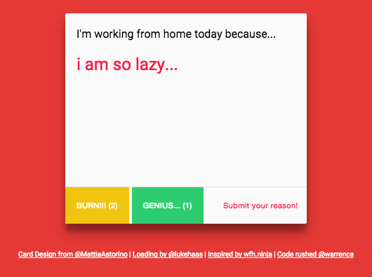

### Requirements
- [Parse](http://parse.com) as database
- PHP for back-end codes and [PHP Composer](https://getcomposer.org/download/) to install PHP Packages
- [npm](https://nodejs.org/) for bower installation
- [Bower](http://bower.io/) to install Javascript packages

### Installation
 
```$ composer.phar install && bower install ```

### Configuration

Setup your Parse account, create an app, and get the APP_ID, REST_KEY & MASTER_KEY from [https://www.parse.com/apps/{your-app-namespace}/edit#keys](https://www.parse.com/apps/{your-app-namespace}/edit#keys).

Open ```config.php``` and replace the values with your key.

```
const APP_ID = 'PARSE_APP_ID';
const REST_KEY = 'PARSE_REST_KEY';
const MASTER_KEY = 'PARSE_MASTER_KEY';
```

### Running the app

You must be using PHP 5.4.0 and up to use the PHP Built-In development server

```
$ cd /path-to/wfh-asia
$ php -S localhost:8000
```

### It should look like this if it's working.


